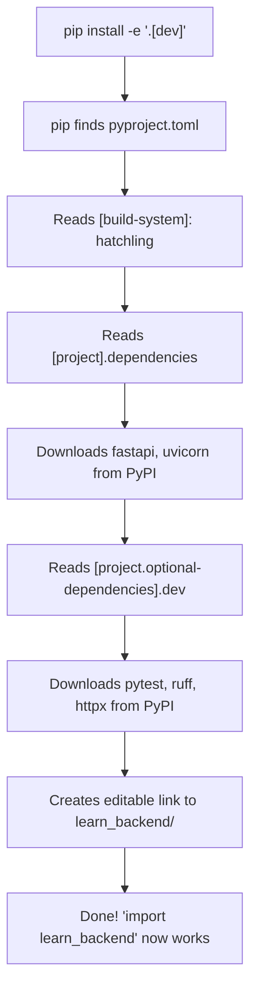

# PR 1: Python Project Setup

## What we built

A properly structured Python project with:
- `pyproject.toml` -- defines the project metadata and dependencies
- `.gitignore` -- tells git which files to NOT track
- `learn_backend/` -- our Python package (the actual code)
- `tests/` -- where our tests live
- `README.md` -- documentation for anyone who clones this repo

## Why this matters

Before writing any backend code, you need a project structure that:
1. Other developers can clone and run immediately
2. Has reproducible dependencies (everyone gets the same library versions)
3. Separates your code from configuration from tests
4. Can be installed as a package (so imports work cleanly)

Without this, you'd be running loose `.py` files with `pip install` commands scattered in chat messages. That's how things break on other people's machines.

---

## Concept: What is a Python Package?

A **package** is a folder with an `__init__.py` file inside it. That's it.

```
learn_backend/          <-- this is a package
    __init__.py         <-- this file makes it a package
```

When Python sees a folder with `__init__.py`, it treats that folder as importable:

```python
import learn_backend          # works because __init__.py exists
from learn_backend import foo  # would work if foo.py existed inside
```

Without `__init__.py`, Python doesn't know the folder contains code. It's just a folder.

**Why not just put everything in one file?**
- Real projects have hundreds of files. You need folders.
- Packages let you organize code into logical groups (routers, models, services, etc.)
- dubbing-service has `dubbing_service/` with 20+ sub-modules

---

## Concept: What is pyproject.toml?

`pyproject.toml` is the **single source of truth** for your Python project. It replaces the older `setup.py`, `setup.cfg`, and `requirements.txt` approach.

It answers three questions:

### 1. "What IS this project?"

```toml
[project]
name = "learn-backend"
version = "0.1.0"
description = "A step-by-step learning repo for backend concepts"
requires-python = ">=3.11"
```

### 2. "What does it NEED to run?"

```toml
dependencies = [
    "fastapi>=0.115.0",
    "uvicorn>=0.23.0",
]
```

These are **runtime dependencies** -- libraries your code imports. When someone runs `pip install -e .`, pip reads this list and installs them all.

### 3. "What do DEVELOPERS need additionally?"

```toml
[project.optional-dependencies]
dev = [
    "pytest>=8.0.0",
    "ruff>=0.8.0",
    "httpx>=0.28.0",
]
```

These are **dev dependencies** -- tools for testing, linting, etc. Users of your app don't need them. Developers install them with `pip install -e ".[dev]"`.

### 4. "How is it built?"

```toml
[build-system]
requires = ["hatchling"]
build-backend = "hatchling.build"
```

This tells pip HOW to turn your source code into an installable package. `hatchling` is the build tool (like a compiler for Python packages).

---

## Concept: What is a Virtual Environment (.venv)?

A virtual environment is an **isolated Python installation** for your project.

### The problem without it

```
Machine Python has: requests==2.25
Project A needs:    requests==2.28
Project B needs:    requests==2.31
```

If you install globally, Project A and B fight over which version to use. Someone loses.

### The solution

```bash
python -m venv .venv        # Create isolated environment
source .venv/bin/activate   # "Enter" the environment
pip install -e ".[dev]"     # Install HERE, not globally
```

Now this project has its own copy of Python and its own set of libraries. No conflicts.

```
.venv/
  bin/python          <-- this project's Python
  lib/python3.11/
    site-packages/
      fastapi/        <-- this project's FastAPI
      uvicorn/        <-- this project's Uvicorn
```

### How do you know you're "in" a venv?

Your terminal prompt changes:

```
(.venv) $ python     <-- you're in the venv
$        python      <-- you're using system Python (dangerous!)
```

---

## Concept: What is .gitignore?

Git tracks every file in your project. But some files should NEVER be committed:

| File/Folder | Why ignore it |
|---|---|
| `.venv/` | Virtual env is 200+ MB. Everyone creates their own locally. |
| `__pycache__/` | Python auto-generates these compiled files. They're machine-specific. |
| `.env` | Contains secrets (passwords, API keys). Committing = security breach. |
| `.DS_Store` | macOS junk file. |
| `*.egg-info/` | Build artifacts. Regenerated on install. |
| `htmlcov/` | Test coverage reports. Generated, not source. |

**Rule of thumb:** If a file is GENERATED or contains SECRETS, it goes in `.gitignore`.

---

## Concept: What is `pip install -e .`?

The `-e` stands for **"editable"**. Let's compare:

```bash
pip install .        # Copies your code INTO .venv/lib/. Changes to source = not reflected.
pip install -e .     # Creates a LINK from .venv to your source. Changes = instantly reflected.
```

During development, you always want `-e` (editable). Otherwise you'd need to re-install after every code change.

The `.` means "install the project in the current directory" (where `pyproject.toml` lives).

---

## Flow: What happens when you run `pip install -e ".[dev]"`?



---

## How this maps to dubbing-service

| Our file | dubbing-service equivalent | Notes |
|---|---|---|
| `pyproject.toml` | `dubbing-service/pyproject.toml` | They use Poetry (`[tool.poetry]`) instead of standard `[project]`. Same idea, different tool. |
| `.gitignore` | `dubbing-service/.gitignore` (implicit) | Same patterns. |
| `learn_backend/__init__.py` | `dubbing_service/__init__.py` | Same concept -- marks the folder as a package. |
| `tests/` | `dubbing-service/tests/` | Same structure. They configure pytest in pyproject.toml too. |
| `[tool.ruff]` | `dubbing-service/pyproject.toml` `[tool.ruff]` | Same linter. They have more rules because their codebase is larger. |

**Key difference:** dubbing-service uses **Poetry** (`[tool.poetry.dependencies]`) while we use the standard **PEP 621** format (`[project].dependencies`). Poetry was popular before Python standardized `pyproject.toml`. Both achieve the same goal: declare dependencies. The standard format (`[project]`) is now recommended for new projects.

---

## How to test this locally

```bash
# 1. Clone/navigate to the project
cd Zlearning_concepts

# 2. Create virtual environment
python3 -m venv .venv

# 3. Activate it
source .venv/bin/activate

# 4. Install the project with dev dependencies
pip install -e ".[dev]"

# 5. Verify the package is importable
python -c "import learn_backend; print('SUCCESS')"

# 6. Run tests
pytest -v

# 7. Check what's installed
pip list | head -20
```

---

## Files in this PR

```
Zlearning_concepts/
  pyproject.toml           <-- Project metadata + dependencies
  .gitignore               <-- Files git should ignore
  README.md                <-- How to set up the project
  learn_backend/
    __init__.py            <-- Makes this folder a Python package
  tests/
    __init__.py            <-- Makes tests folder a package too
    test_smoke.py          <-- Verifies the package imports correctly
  docs/
    explainers/
      pr-01-python-project-setup.md   <-- This file!
```
