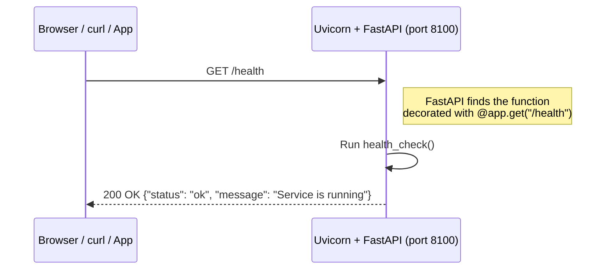
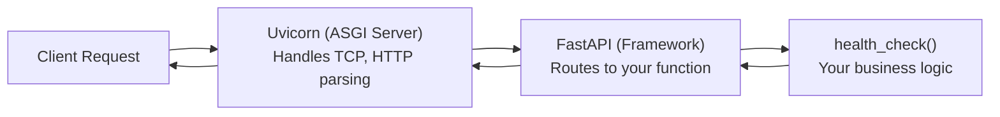
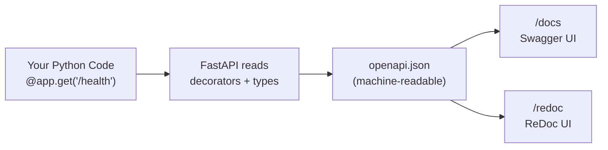
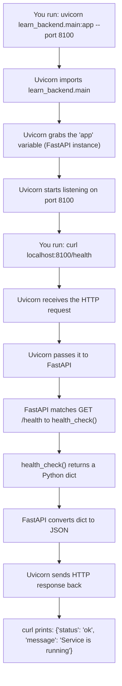

# PR 2: Hello World FastAPI Server

## What we built

A running web server with one endpoint:
- `GET /health` -- returns `{"status": "ok", "message": "Service is running"}`

Two new files:
- `learn_backend/main.py` -- the FastAPI application
- `tests/test_health.py` -- 4 tests for the health endpoint

## Why this matters

Every backend service in the world starts here: a process that listens on a network port and responds to HTTP requests. Without this, there is no API. This is the foundation everything else is built on.

---

## Concept: What is a Web Server?

A web server is a program that:
1. **Listens** on a network port (e.g., port 8000)
2. **Receives** HTTP requests from clients (browsers, mobile apps, other services)
3. **Processes** the request (runs your code)
4. **Returns** an HTTP response



**Key insight:** Your Python code doesn't deal with raw network sockets, TCP packets, or HTTP parsing. **Uvicorn** handles all that. Your code just says "when someone hits `/health`, run this function and return this dict."

---

## Concept: What is HTTP?

HTTP (HyperText Transfer Protocol) is the language clients and servers speak. Every request has:

### Request (what the client sends)

```
GET /health HTTP/1.1        <-- Method + Path + Protocol version
Host: localhost:8100         <-- Where to send it
Accept: application/json     <-- What format the client wants back
```

### Response (what the server sends back)

```
HTTP/1.1 200 OK              <-- Protocol + Status Code + Reason
content-type: application/json
                              <-- Empty line separates headers from body
{"status": "ok", "message": "Service is running"}
```

### HTTP Methods (the verbs)

| Method | Meaning | Example |
|---|---|---|
| **GET** | "Give me data" | Fetch a job's details |
| **POST** | "Create something new" | Create a new dubbing job |
| **PUT** | "Replace/update something" | Update a task's status |
| **DELETE** | "Remove something" | Delete a job |
| **PATCH** | "Partially update" | Change just the job name |

dubbing-service uses all of these. For now we only use GET.

### HTTP Status Codes (the server's answer summary)

| Code | Meaning | When |
|---|---|---|
| **200** | OK | Everything worked |
| **201** | Created | A new resource was created |
| **400** | Bad Request | Client sent invalid data |
| **401** | Unauthorized | No valid auth token |
| **404** | Not Found | That URL doesn't exist |
| **422** | Unprocessable Entity | Validation failed (FastAPI uses this) |
| **500** | Internal Server Error | Bug in your code |

---

## Concept: What is FastAPI?

FastAPI is a **Python web framework**. A framework provides the structure so you don't build everything from scratch.

**What FastAPI gives you for free:**
- URL routing (map URLs to Python functions)
- Request parsing (read JSON body, query params, path params)
- Response serialization (convert Python dicts to JSON)
- Input validation (via Pydantic -- PR 4)
- Auto-generated API docs (Swagger UI at `/docs`)
- Async support (handle many requests concurrently)

**What you provide:**
- Your business logic (the actual work the endpoint does)

### Why FastAPI over Flask/Django?

| Feature | Flask | Django | FastAPI |
|---|---|---|---|
| Async native | No (needs workaround) | Partial | Yes |
| Auto docs | No | No | Yes (OpenAPI/Swagger) |
| Type hints | Optional | Optional | Required (enforced) |
| Validation | Manual | Forms-based | Pydantic (automatic) |
| Speed | Moderate | Moderate | Very fast (on par with Go/Node) |

dubbing-service chose FastAPI because: async is essential for handling many concurrent dubbing jobs, and auto-generated docs help frontend developers integrate quickly.

---

## Concept: What is Uvicorn?

**Uvicorn** is an ASGI server. Think of it as the "engine" that actually listens on the network port.



**Analogy:** If FastAPI is the chef who cooks the food, Uvicorn is the waiter who takes orders from customers and brings food back. The chef never talks to customers directly.

### ASGI vs WSGI

- **WSGI** (old): Handles one request at a time per worker. Used by Flask/Django.
- **ASGI** (new): Handles many requests concurrently via async. Used by FastAPI.

This is why the function uses `async def` -- it's an async function that doesn't block the server while running.

---

## Code Walkthrough: main.py

```python
from fastapi import FastAPI

app = FastAPI(
    title="Learn Backend API",
    description="A step-by-step learning API for backend concepts",
    version="0.1.0",
)


@app.get("/health", tags=["Health Check"])
async def health_check():
    return {"status": "ok", "message": "Service is running"}
```

Let's break down every line:

### Line 1: `from fastapi import FastAPI`

Import the FastAPI class from the `fastapi` library (which we declared in `pyproject.toml`).

### Lines 3-7: `app = FastAPI(...)`

Create a **FastAPI application instance**. This is THE central object. Everything attaches to it -- routes, middleware, error handlers. The keyword arguments (`title`, `description`, `version`) appear in the auto-generated docs at `/docs`.

In dubbing-service, this same pattern appears at line 52 of `api.py`:
```python
app = FastAPI(
    lifespan=lifespan,
    exception_handlers={...},
    title="Dubbing Service API",
    version="0.1.0",
)
```

They also pass `lifespan` (startup/shutdown logic) and `exception_handlers` -- we'll add those in later PRs.

### Lines 10-12: The route decorator

```python
@app.get("/health", tags=["Health Check"])
async def health_check():
    return {"status": "ok", "message": "Service is running"}
```

- `@app.get("/health")` -- This is a **decorator**. It tells FastAPI: "When someone sends a GET request to `/health`, call this function."
- `tags=["Health Check"]` -- Groups this endpoint in the docs UI.
- `async def` -- This is an async function. Uvicorn can handle other requests while this one runs.
- `return {"status": "ok", ...}` -- FastAPI automatically converts this Python dict to JSON and sets the response `Content-Type: application/json`.

In dubbing-service, line 94-96:
```python
@app.get("/health", tags=["Health Check"])
async def health_check():
    return {"message": "Service is running"}
```

Nearly identical. Health checks are used by load balancers and Kubernetes to know if the service is alive.

---

## Code Walkthrough: tests/test_health.py

```python
from fastapi.testclient import TestClient
from learn_backend.main import app

client = TestClient(app)
```

**`TestClient`** wraps our FastAPI `app` so we can send fake HTTP requests without starting a real server. No network, no port -- it's all in-memory. This makes tests fast and reliable.

```python
def test_health_returns_200():
    response = client.get("/health")
    assert response.status_code == 200
```

Send a GET to `/health`. Verify the status code is 200 (OK). If it's not, the test fails.

```python
def test_docs_page_accessible():
    response = client.get("/docs")
    assert response.status_code == 200
```

FastAPI auto-generates a Swagger UI at `/docs`. This test verifies it exists. Your frontend developers will use this page to explore the API.

```python
def test_unknown_route_returns_404():
    response = client.get("/this-does-not-exist")
    assert response.status_code == 404
```

If someone hits a URL that doesn't exist, the server should return 404 (Not Found), not crash.

---

## Concept: What is `uvicorn learn_backend.main:app`?

When you run the server, the command is:

```bash
uvicorn learn_backend.main:app --port 8100
```

Breaking it down:

| Part | Meaning |
|---|---|
| `uvicorn` | The ASGI server program |
| `learn_backend.main` | Python module path: `learn_backend/main.py` |
| `:app` | The variable name inside that module (our FastAPI instance) |
| `--port 8100` | Listen on port 8100 |

This is the **import path** syntax: `package.module:variable`. Uvicorn imports `learn_backend.main` and grabs the `app` object, then starts serving it.

---

## Concept: What are Auto-Generated Docs?

FastAPI automatically creates two documentation pages:

| URL | What | Format |
|---|---|---|
| `/docs` | **Swagger UI** -- interactive API explorer. You can send requests from the browser. | HTML |
| `/redoc` | **ReDoc** -- read-only, cleaner documentation. | HTML |
| `/openapi.json` | **OpenAPI spec** -- machine-readable JSON describing all endpoints. | JSON |

These are generated from your Python code -- the function signatures, type hints, and docstrings. No manual docs needed.



---

## How this maps to dubbing-service

| Our code | dubbing-service | Notes |
|---|---|---|
| `app = FastAPI(...)` | `api.py` line 52-63 | Same pattern. They add exception_handlers and lifespan. |
| `@app.get("/health")` | `api.py` line 94-96 | Identical. Every service needs a health check. |
| `uvicorn learn_backend.main:app` | `__main__.py` -> `startup(app, ...)` | They use a helper from `sarvam-service-base` but it's still uvicorn underneath. |
| `TestClient(app)` | `tests/` use `httpx.AsyncClient` | Same concept, slightly different library for async tests. |

---

## Flow: What happens when you run the server and hit /health?



---

## How to test locally

```bash
# Make sure venv is active
cd Zlearning_concepts
source .venv/bin/activate

# Run tests (no server needed!)
pytest -v

# Start the server
uvicorn learn_backend.main:app --port 8100

# In another terminal, test with curl:
curl http://localhost:8100/health
curl http://localhost:8100/docs     # open this in browser!

# Stop server with Ctrl+C
```

---

## Files changed in this PR

```
learn_backend/
  main.py                 <-- NEW: FastAPI app + /health endpoint
tests/
  test_health.py          <-- NEW: 4 tests for the health endpoint
docs/explainers/
  pr-02-hello-world-fastapi.md  <-- NEW: this explainer
```
